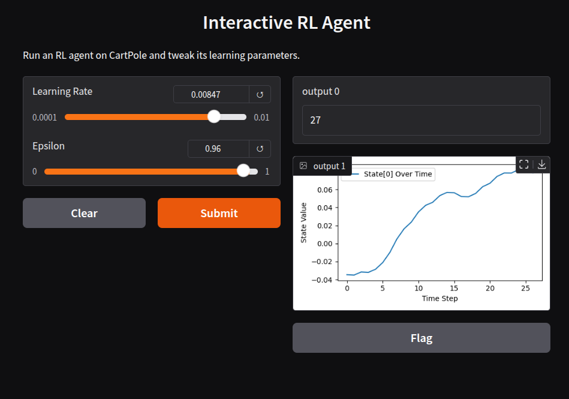

# Interactive RL Agent with Gradio  
This project lets you interact with a Deep Q-Network (DQN) agent using Gradio. You can tweak hyperparameters and visualize training performance.  

## Installation  
pip install -r requirements.txt  

## Usage  
python app.py  

## UI with Gradio  
  

## Features  
- Adjust hyperparameters (learning rate, epsilon, etc.)  
- Run episodes and visualize results  
- Uses OpenAI Gym and Gradio for an interactive experience  

## Dependencies  
- gradio  
- gym  
- torch  
- numpy  
